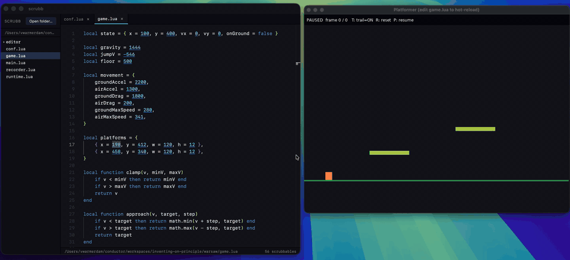

<p align="center">
  
</p>

# scrubb

A code editor with Bret-Victor-style scrubbable numeric literals, built on Tauri, Vite, TypeScript, and Monaco.

Drag horizontally on a number in the editor to scrub its value live. Hold Shift while dragging for finer steps.

## Demo

[](https://koaning.github.io/scrubb-editor/)

The full video is on **[koaning.github.io/scrubb-editor](https://koaning.github.io/scrubb-editor/)**.

## Install

There are no prebuilt downloads yet, so build and install the app locally:

```sh
git clone https://github.com/koaning/scrubb-editor.git
cd scrubb-editor
npm install
npm run tauri:install
```

This builds `src-tauri/target/release/bundle/macos/scrubb.app` and copies it to `/Applications`, replacing any existing `scrubb.app` there. To build without installing, run `npm run tauri:build:app` or `make app` and drag the resulting bundle in yourself.

Because the local build is unsigned, macOS will block the first launch. Right-click the app, choose **Open**, then confirm **Open** once.

## CLI

To launch scrubb from a terminal, symlink the bundled binary onto your `PATH`:

```sh
sudo ln -s /Applications/scrubb.app/Contents/MacOS/scrubb /usr/local/bin/scrubb
```

Then `scrubb .` opens the current folder.

## Development

Prerequisites, commands, local workflow notes, and release steps live in [developers.md](developers.md).
